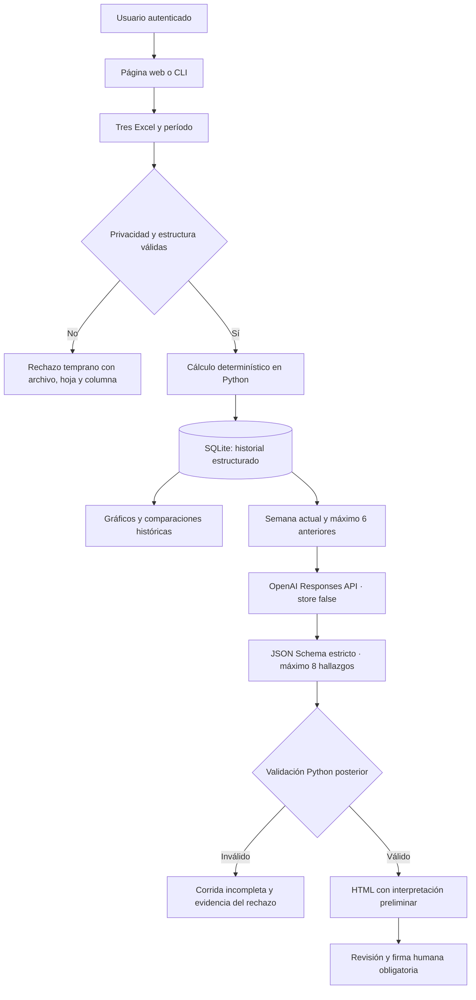

# Arquitectura y evolución del agente

## Arquitectura final

Python es la única fuente de métricas. El LLM recibe hechos textuales filtrados y sólo propone relaciones entre fallas. No puede alterar disponibilidad, horas, detenciones, Excel ni registros técnicos.

## Evolución trazable

```mermaid
flowchart LR
    I1["Iteración 1 · respuesta textual"] --> I2["Iteraciones 2–6 · cálculo semanal y HTML"]
    I2 --> I3["Semanas 29–36 · SQLite, web e historial"]
    I3 --> V11["v1.1 · conector explícito y reproducción"]
    V11 --> V12["v1.2 · control de alcance por puente"]
    V12 --> V13["v1.3 · utilidad, límite y no redundancia"]
    V13 --> V131["v1.3.1 · benchmark resiliente"]
    V131 --> V14["v1.4 · cierre automático y modelo validado"]
```

La evaluación externa de 85/100 motivó evidencia específica para SC-02, FR-03 y AE-03. La ronda 1 del benchmark se conservó aunque no aprobó. La ronda 2 comparó los mismos tres modelos sobre las mismas semanas y, después de 33 revisiones humanas, seleccionó GPT-5.4 Mini con razonamiento `medium`.

Las fallas y decisiones se conservan en `corridas/desarrollo_historico/` y `DECISIONES.md`. Las versiones nuevas no reescriben las corridas anteriores: agregan controles para ejecuciones posteriores y evidencia reproducible para el examen.
